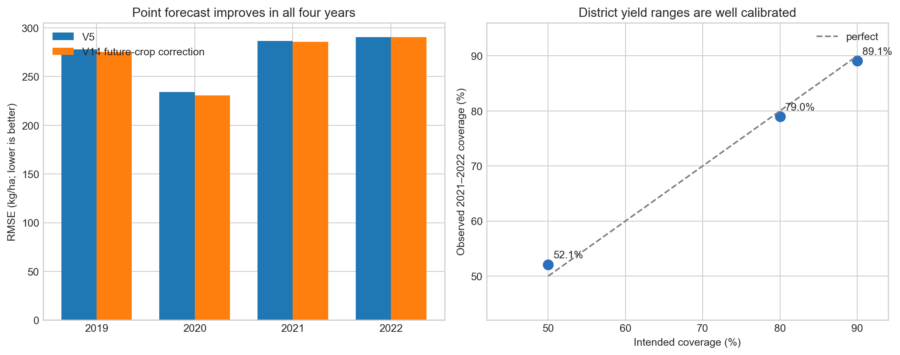

# V14: anomaly forecasts, future-crop correction, and district yield ranges

## Bottom line

V14 tested two requested ideas end to end:

1. predict the seasonal yield anomaly directly, without using V5; and
2. feed the predicted next-month crop condition into matched XGBoost models,
   then use only the change caused by future-crop information.

The standalone anomaly model is useful but does not beat V5. The second idea
does produce a small, repeatable gain.

| March 5 point model | 2019–2022 RMSE | 2021–2022 RMSE | Decision |
|---|---:|---:|---|
| Frozen V5 | 273.26 | 288.61 | Keep as safe point model |
| **V14 future-crop correction** | **271.65** | **288.13** | Keep as frontier shadow |
| Standalone anomaly XGBoost | 306.48 | 328.47 | Retain; not a V5 replacement |

The V14 shadow improves RMSE in 2019, 2020, 2021, and 2022. Its late gain is
only 0.48 kg/ha and its grouped confidence range still barely crosses zero.
That is why it is retained rather than discarded, but not yet declared a
confirmed production replacement.

V14 also produces a complete probability distribution for every district. On
2021–2022, the primary ranges achieve:

| Intended range | Actual coverage | Average total width |
|---|---:|---:|
| 50% | 52.1% | 329 kg/ha |
| 80% | 79.0% | 661 kg/ha |
| 90% | 89.1% | 942 kg/ha |

Start with [RESULT.md](RESULT.md) for the plain-language findings,
[METHODOLOGY.md](METHODOLOGY.md) for exact experiments, [AUDIT.md](AUDIT.md)
for evidence and limitations, and [RUNBOOK.md](RUNBOOK.md) to reproduce the
release.

