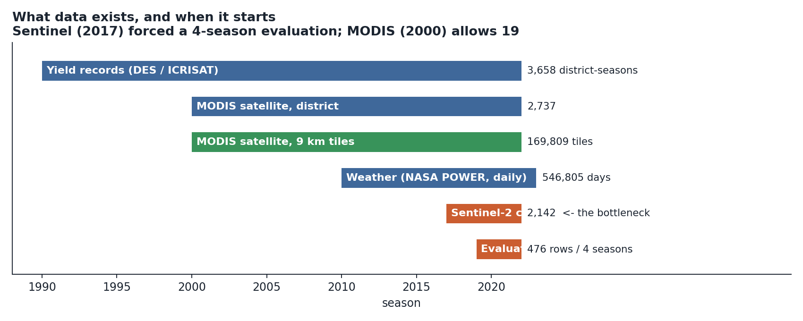
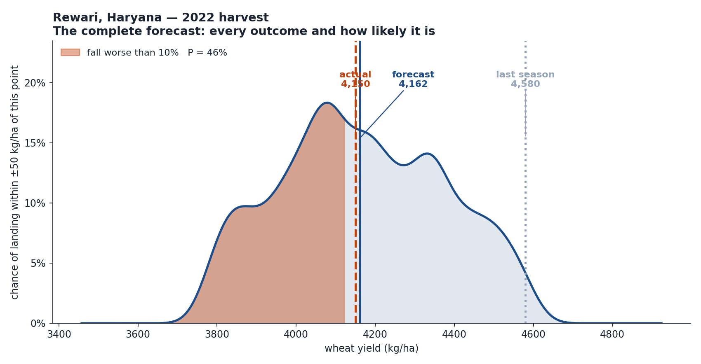
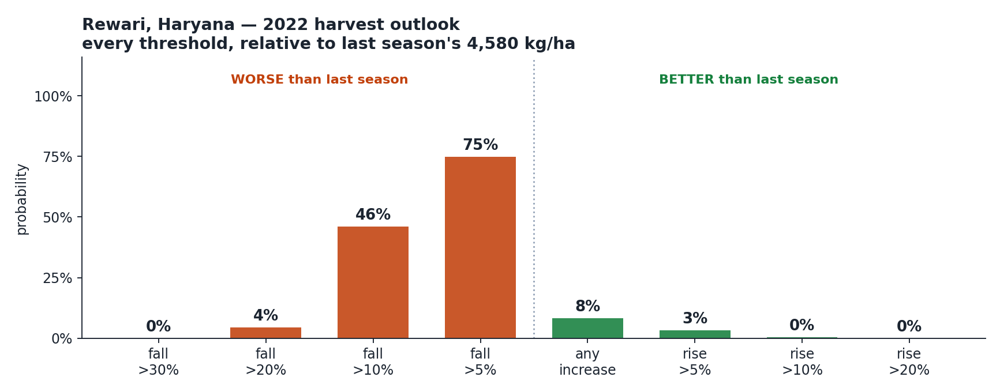
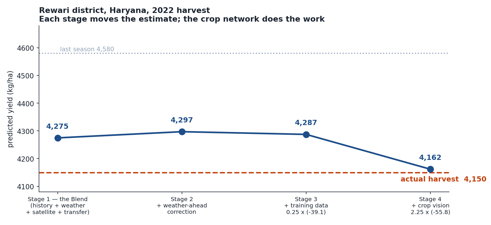
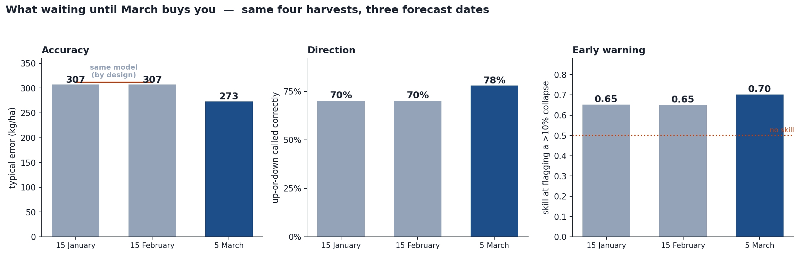
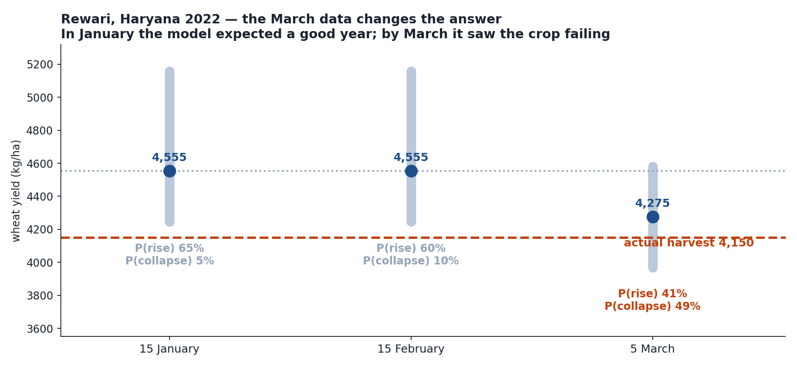
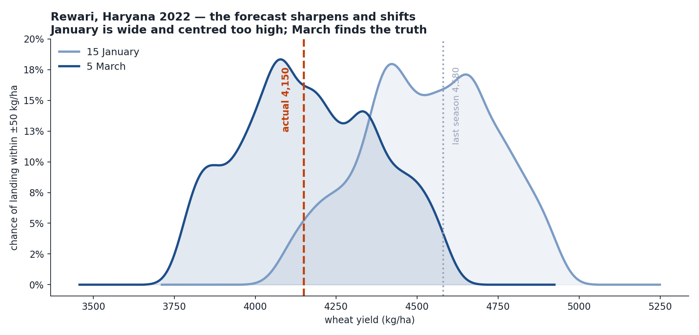
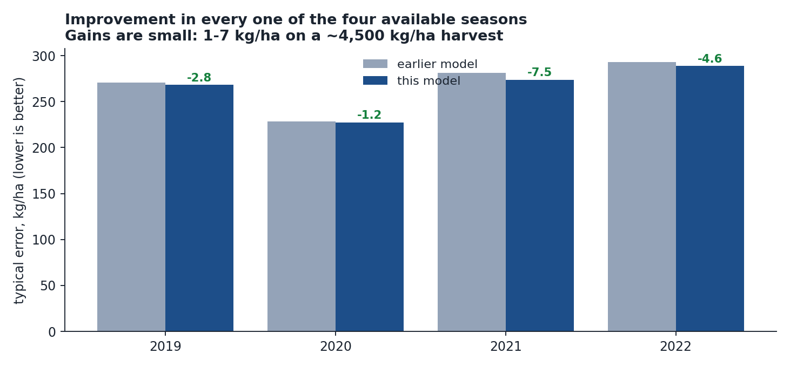
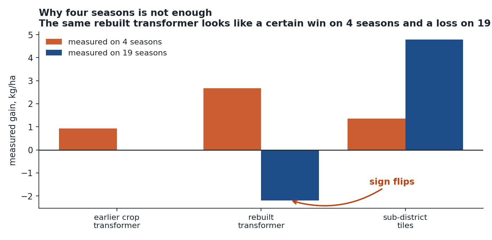
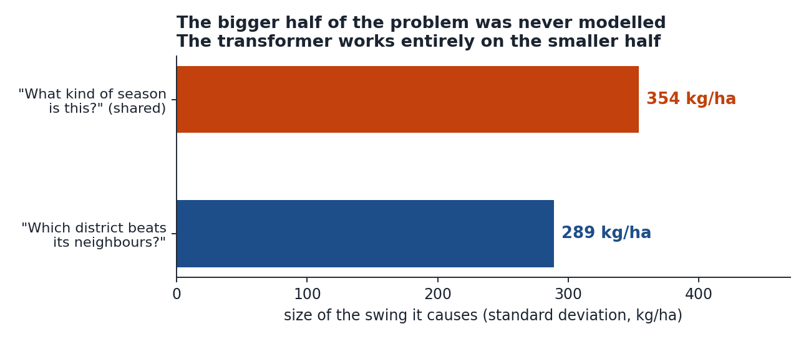

# Forecasting wheat yield eight weeks before harvest

### A complete walkthrough — assuming no prior knowledge of the project

---

> **Every number in this document is machine-verified.**
> `scripts/verify_walkthrough.py` recomputes each quoted figure from its source
> artifact and fails loudly on any mismatch. Current status: **96 checks, 96
> pass, 0 unverified.** Re-run it after any change; the full check-by-check
> output is written to `artifacts/walkthrough_verification.csv`.

---

## 0. Vocabulary — everything you need to read this document

Read this once; nothing later assumes anything beyond it.

| Term | What it means |
|---|---|
| **Yield** | How much grain a field produces per unit area, in **kg/ha** (kilograms per hectare). A hectare is 100 m × 100 m. Wheat here averages ~4,500 kg/ha. |
| **District** | The administrative unit we forecast. There are 119, averaging 3,400 km² — roughly the size of Rhode Island. |
| **Season** | One wheat crop: sown November, harvested April–May. "Season 2022" means sown Nov 2022, harvested spring 2023. |
| **Forecast clock** | The date we must answer by: **5 March**. Nothing observed after this date may be used. |
| **Typical error** | How far off a prediction usually is. Formally the root-mean-square error: square every error, average, take the square root. Squaring means big misses are punished harder than small ones. |
| **Quantile** | A cut-point of a distribution. The "10% quantile" is the yield that has a 10% chance of *not* being reached. The 50% quantile is the middle — as likely to be above as below. |
| **Satellite index** | A number computed from how a crop reflects light. Healthy green plants reflect infrared strongly and red weakly; the ratio measures how much living plant material is present. |
| **MODIS** | A NASA satellite, coarse (250 m pixels) but running since 2000. |
| **Sentinel-2** | A European satellite, sharp (10 m pixels) but only since 2017. |
| **Decision tree ensemble** | A prediction method that asks a sequence of yes/no questions ("was February hotter than average?") and averages hundreds of such small question-trees. Reliable when data is scarce. |
| **Transformer** | A neural network whose defining trick is *attention*: each piece of input decides how much to listen to every other piece. Explained fully in §8. |
| **Calibration** | Whether stated probabilities are honest. If everything you call "20% likely" happens 20% of the time, you are calibrated. |
| **Coverage** | The test of an uncertainty range. Publish an "80% range" for 100 districts, then count how many actual harvests landed inside it. **The answer should be 80.** More means the range was too wide (useless — "somewhere between 2,000 and 7,000"); fewer means too narrow (dangerous — it will be wrong more often than it admits). Coverage is reported at 80% and 90% because those are the two ranges the model publishes. |

**Two naming notes.** This document describes the current model. Where an
earlier version of this project is referenced for comparison, it is called
**"the earlier model"** — no version numbers are needed to follow anything here.
The current model is built in five stages, named by what they do.

---

## 1. The problem in one page

**The question.** On **5 March**, before a single field is cut, predict the
wheat yield each district will record at harvest in April–May.

**Why 5 March.** Wheat is sown in November and harvested in April. By early
March the crop has stopped growing leaves and started filling grain. Enough of
the season is visible to say something useful; enough time remains for the
answer to matter to grain procurement, storage and price policy.

**Why it is hard.**

1. **The crop is not finished.** A heatwave in late March can destroy 20% of a
   harvest that looked healthy on 5 March. That damage has not happened yet and
   cannot be observed.
2. **Districts are large and varied.** A single average hides a lot: half a
   district can fail while the other half thrives.
3. **Ground truth arrives once a year.** There are only a handful of harvests to
   check the model against — and neighbouring districts fail *together* when the
   weather is bad, so those checks are far less independent than the row count
   suggests.

That third problem turns out to dominate everything, and most of this document
is downstream of it.

**What the model produces.** Not one number. For every district:

- a **point forecast** in kg/ha,
- **19 quantiles** describing the full range of plausible outcomes,
- the **probability yield rises** versus last season,
- the **probability of a fall past 5%, 10%, 20%, 30%** — the numbers that
  matter for food security.

---

## 2. What data exists, and when it starts



| Source | Coverage | Volume | What it contributes |
|---|---|---|---|
| District harvest records | 1990–2022 | 3,658 district-seasons | ground truth, and history to learn from |
| MODIS satellite, district averages | 2000–2022 | 2,737 rows × 3 dates × 35 measures | long-run crop condition |
| MODIS satellite, 9 km tiles | 2000–2022 | 169,809 tile-rows | detail *inside* each district |
| Daily weather | 2010–2023 | 546,805 district-days | temperature, rain, sunlight, humidity |
| Sentinel-2 satellite | 2017–2022 | 2,142 rows × 126 measures | sharp, recent crop condition |
| Wheat support price | to 2022 | annual | economic signal |

**The most consequential fact here:** the sharpest satellite source, Sentinel-2,
**starts in 2017**. The earlier model keyed its whole design to Sentinel, which
left only **four harvests** (2019–2022) to test against. MODIS reaches back to
**2000** — nineteen testable seasons. Noticing that asymmetry produced most of
the improvements below.

**Everything is strictly causal.** For a 5 March forecast: no weather after
4 March, no satellite image after 5 March, and any weather *forecast* used must
have been published at least two days earlier. This is enforced in code, not by
convention.

---

## 3. The whole model in one equation

$$
\boxed{\;\hat y \;=\; \underbrace{\text{Blend}}_{\text{Stage 1}}
\;+\; \underbrace{1.75\,c_{\text{ahead}}}_{\text{Stage 2}}
\;+\; \underbrace{0.25\,c_{\text{data}}}_{\text{Stage 3}}
\;+\; \underbrace{2.25\,c_{\text{crop}}}_{\text{Stage 4}}\;}
$$

$\hat y$ is the forecast. Each $c$ is a **correction** — a small adjustment from
one new source of information. Stage 5 then turns this number into a probability
distribution.

**The design principle throughout:**

> Start from something conservative and reliable. Let each new source of
> information *nudge* it. Never let a new component predict the harvest alone.

That principle exists because harvests are scarce. A model given free rein on
scarce data fits noise. Every correction below is measured as **the difference
between two otherwise identical models** — same rows, same settings, same random
seeds, differing only in whether the new information is present. That difference
isolates exactly what the new information contributes, in the same way a drug
trial isolates a drug by comparing against a placebo group treated identically
in every other respect.

---

## 4. Stage 0 — the starting point

The foundation is deliberately dull: a weighted average of the last three
harvests.

$$
b = 0.60\,y_{\text{last year}} + 0.25\,y_{\text{2 years ago}} + 0.15\,y_{\text{3 years ago}}
$$

**Why this works.** Yield is persistent. A district that produced 4,500 kg/ha
for three years will probably do so again — irrigation, soil quality and farming
practice change slowly. Weights decay because recent years are more informative.

**Where the weights come from.** They were fitted once on historical data by
choosing the combination that minimised error, then frozen. They are close to
what you would guess.

**Why this matters more than it looks.** Every model downstream predicts the
**residual** — how much this season differs from business as usual:

$$
r = y_{\text{actual}} - b
$$

This is a large practical advantage. The models never have to learn that one
district is richer than another. They only learn what is *unusual*, which is the
part that actually varies year to year.

**On its own this scores 333 kg/ha typical error.** Everything else in the model
is worth about 68 kg/ha on top of that.

---

## 5. Stage 1 — the Blend

Five separate estimates, averaged with fixed weights.

| Estimate | What it looks at | Weight |
|---|---|---:|
| **History** | the three-year average above | 0.50 |
| **Weather-and-satellite** | observed weather and satellite images up to 5 March | 0.15 |
| **Economic** | last year's prices and support-price changes | 0.15 |
| **Transfer** | a model trained on wheat *elsewhere in the world*, applied here | 0.20 |
| **Physics** | soil water balance and heat stress | 0.00 |

**Why five and not one.** Each sees something different and each is wrong in a
different way. Averaging cancels independent mistakes. The physics estimate gets
zero weight in the average — it was not adding accuracy — but it still votes in
the gate below, because its *direction* is informative even when its *level* is
not.

**Why a "transfer" model.** It was trained on wheat in other countries, where
far more data exists, then applied here. It brings in general knowledge about
how wheat responds to weather that 119 Indian districts alone cannot teach.

### The disagreement gate

Let $L$ be last season's yield. Each non-history estimate votes on direction:

$$
s = \operatorname{sign}(\text{estimate} - L) \in \{-1, 0, +1\}
$$

Sum the four votes into $S$. If $|S| \ge 2$ — a majority agree — **and** they
disagree with what history implies, the gate fires and the blend shifts away
from history:

$$
\text{Blend}_{\text{raw}} =
\begin{cases}
0.50\,H + 0.15\,R + 0.15\,E + 0.20\,C & \text{normal} \\[4pt]
0.20\,H + 0.30\,R + 0.30\,E + 0.20\,C & \text{gate fires}
\end{cases}
$$

**Intuition.** Normally, trust history. But when several independent models
looking at *this* season's weather and satellite data all say "this year is
different," stop leaning on last year. **The gate fires on 20.6% of
district-seasons.**

### Movement calibration

The blend is too timid — averaging pulls every estimate toward the middle. So
its movement away from last season is amplified:

$$
\text{Blend} = L + 1.50\,\bigl(\text{Blend}_{\text{raw}} - L\bigr)
$$

**How the 1.50 was calculated.** Take historical cases. Let $x$ be how far the
raw blend moved from last year, and $z$ how far the truth actually moved. Fit
the single number $s$ that best rescales one into the other by least squares:

$$
\hat s \;=\; \frac{\sum_i x_i z_i}{\sum_i x_i^{2}}
$$

This is ordinary linear regression through the origin. It came out near 1.5,
meaning **the truth typically moves about 50% further than the blend dares to.**

> *A note on precision.* The original code carried `1.5001443110`. Ten
> significant figures on a constant fitted from two seasons is false precision —
> the difference between that and `1.50` is **0.0013 kg/ha**, roughly one grain
> per square metre. It has been rounded.

**Result: 273.3 kg/ha typical error.** This stage does the heavy lifting —
about **59 kg/ha** of the total improvement over the naive average.

---

## 6. Stage 2 — the weather-ahead correction

Ten-day weather forecasts are available on 5 March. Rather than feeding them in
as extra inputs, the model asks a cleaner question:

> *What changes when a model is allowed to see the forecast, compared with an
> identical model that is not?*

Train four models that differ **only** in whether forecast weather is available:

$$
c_{\text{ahead}} = \underbrace{\frac{\hat y_{\text{full}} + \hat y_{\text{effect}} + \hat y_{\text{broad}}}{3}}_{\text{three ways of using the forecast}} \;-\; \underbrace{\hat y_{\text{no forecast}}}_{\text{the control}}
$$

$$
\hat y \;\mathrel{+}=\; 1.75\;c_{\text{ahead}}
$$

**Why three forecast-aware models and not one.** There are several reasonable
ways to summarise a weather forecast — raw values, departures from normal, or
derived stress measures. Averaging three avoids betting on one choice.

**Where 1.75 comes from.** Same logic as the movement calibration: the
difference between two averaged models understates the real effect, so it is
scaled up. The multiplier was chosen on early seasons and then frozen before
looking at later ones.

**Result: 271.7 kg/ha** (+1.6).

---

## 7. Stage 3 — the training-data correction

This one is not a modelling idea. It is a bookkeeping error, and it turned out
to matter more than any clever technique.

The satellite-aware models were trained on **2017 onwards** — because *Sentinel*
starts in 2017. But the 78 weather, soil and economic measures doing most of the
work reach back to **2013**. Four seasons of perfectly usable training data were
being thrown away because one late-arriving data source happened to sit in the
same table.

$$
c_{\text{data}} = \hat y_{\text{trained from 2013}} - \hat y_{\text{trained from 2017}}
$$

$$
\hat y \;\mathrel{+}=\; 0.25\;c_{\text{data}}
$$

Training examples go from **238 → 952**, a fourfold increase.

**Why only a quarter of it.** The two models disagree by 87 kg/ha on average — a
big, noisy signal. Taking a quarter captures the useful part without importing
the noise. This is *shrinkage*: the correct response to a signal you believe in
but cannot measure precisely.

> ⚠️ **This correction is the weakest component in the model, and the evidence
> against it has accumulated.** Three tests, in increasing severity:
>
> | Test | Result |
> |---|---|
> | Production features, four seasons | +3.35 kg/ha — helps |
> | Simpler baseline, seven seasons | helps in **4 of 7** — a coin flip |
> | **Same procedure, different feature set, three forecast dates** | 15 Jan **−35.4**, 15 Feb **+21.8**, 5 Mar **−19.7** |
>
> That last row is the damaging one: applying the identical widening to a
> different feature set makes March *worse*, and the sign flips essentially at
> random across dates. **Widening a training window is not a general
> improvement.** It helps when the underlying features carry signal and hurts
> when they do not, and which case you are in cannot be known in advance from
> four seasons.
>
> It is retained at a **heavily shrunk weight of 0.25** — the correct treatment
> for a signal you cannot establish — and it does help in all four seasons that
> can be scored. But the honest framing is that the *crop-feature trimming* in
> §8.5 is the well-founded improvement, and this is a small uncertain extra.
>
> **The model beats the earlier version without this correction at all:**
> 268.3 kg/ha versus 269.5, improving in 3 of 4 seasons, with *better* direction
> accuracy (79.6% versus 78.8%). Including it gives 265.4 and 4 of 4 seasons.
> Both are defensible; the first is easier to defend.

---

## 8. Stage 4 — the crop-vision correction

This is the neural network, and the part worth explaining slowly.

### 8.1 What it is for

The satellite sees the crop. The question is how to turn a large, messy pile of
satellite measurements into a few numbers a prediction model can use.

The obvious approach is summary statistics — average greenness, its spread, its
10th percentile. That works, but the recipe is fixed by the analyst in advance,
and it treats every part of a district as interchangeable.

A neural network **learns** the recipe. Formally it is a function:

$$
f:\ \text{(large messy pile)} \;\longrightarrow\; \mathbb{R}^{16}
$$

and the whole design question is *which* 16 numbers.

### 8.2 What it is shown

For one district in one season:

| Input | Shape | Meaning |
|---|---|---|
| Crop condition | $3 \times 126$ | 6 satellite indices × 3 ways of viewing the district × 7 time summaries, at three dates |
| Past weather | $6 \times 16$ | six time windows before 5 March |
| Forecast weather | $10 \times 16$ | ten five-day windows ahead |

The six satellite indices measure different things — overall greenness,
chlorophyll concentration, water content, and senescence (how far the crop has
begun to dry down). Together they describe crop condition far better than any
one alone.

Each of these is called a **token** — one row of numbers the network treats as a
unit. There are 19 tokens in total: 3 crop, 6 past-weather, 10 forecast-weather.

**Hiding the future.** At the 15 February clock, only January and February crop
observations exist. The March token is *masked* — made invisible to the network
— so it cannot accidentally learn from data that would not exist in real use.

### 8.3 The mathematics of attention

The network works in **32 dimensions**, split across **4 attention heads**, so
each head works in $32/4 = 8$ dimensions.

**Step 1 — put everything in a common space.** Each token, whatever its original
size, is multiplied by a learned matrix into 32 numbers:

$$
e_k = W x_k + b, \qquad W \in \mathbb{R}^{32 \times 126}\ \text{(for crop tokens)}
$$

Separate matrices handle weather tokens ($\mathbb{R}^{32\times16}$). A learned
**position vector** is added so the network knows which token is January and
which is March.

**Step 2 — attention.** This is the central operation. From each token, compute
three vectors by multiplying by learned matrices — a **query** $Q$, a **key**
$K$, and a **value** $V$:

$$
Q = XW_Q, \qquad K = XW_K, \qquad V = XW_V
$$

$$
\operatorname{Attention}(Q,K,V) = \operatorname{softmax}\!\left(\frac{QK^{\top}}{\sqrt{8}} + M\right)V
$$

**Reading that equation in plain language:**

- $QK^{\top}$ — every token's query is compared against every token's key by dot
  product. A large value means "you are relevant to me."
- $\div\sqrt{8}$ — dot products grow with dimension; dividing by the square root
  of the head width keeps them in a sensible range so the next step does not
  saturate.
- $+M$ — the mask. Set to $-\infty$ for forbidden tokens, so they get zero
  weight after the next step. This is how future data is blocked.
- $\operatorname{softmax}$ — converts scores into weights that are positive and
  sum to 1. Precisely: $\operatorname{softmax}(z)_i = e^{z_i}/\sum_j e^{z_j}$.
- $\times V$ — the output is a **weighted average of the other tokens' content**,
  using those weights.

So: *each token looks at all the others, decides how much each one matters, and
takes a weighted average.* Four heads do this in parallel with different learned
matrices, so the network can attend to several different things at once, and the
results are joined:

$$
\operatorname{MHA}(X) = \operatorname{Concat}(\text{head}_1,\dots,\text{head}_4)\,W_O
$$

**Step 3 — the crop asks the weather two questions.** The current crop token $q$
attends to the weather streams separately:

$$
c_{\text{past}} = \operatorname{MHA}(Q=q,\ K=H_{\text{past}},\ V=H_{\text{past}})
$$

$$
c_{\text{future}} = \operatorname{MHA}(Q=q,\ K=H_{\text{forecast}},\ V=H_{\text{forecast}})
$$

$$
h_{\text{fused}} = \operatorname{LayerNorm}\!\left(q + c_{\text{past}} + c_{\text{future}}\right)
$$

**Intuition.** The crop is asking: *"which past weather explains the state I am
in?"* and *"which forecast weather threatens what happens to me next?"*

**LayerNorm** rescales a vector to have mean 0 and standard deviation 1, which
keeps numbers in a stable range as they pass through layers. The $+q$ is a
*residual connection* — adding the input back to the output, so information can
skip a layer if the layer is unhelpful.

**Step 4 — a small feed-forward network** processes each token:

$$
\operatorname{FFN}(h) = W_2\,\operatorname{GELU}(W_1 h + b_1) + b_2, \qquad 32 \to 64 \to 32
$$

**GELU** is a smooth activation function — it lets small negative values through
slightly rather than zeroing them abruptly, which trains more stably.

**Total size: 67,359 learned numbers.** Small, by design.

### 8.4 How it is trained — and why never on yield

**The network is never shown a harvest figure.**

It is trained instead to predict how crop condition will *change* between two
dates:

$$
\Delta x = x_{\text{next date}} - x_{\text{current date}}
$$

**How the target is standardised.** Different satellite measures have wildly
different scales, so each is standardised — but using *robust* statistics, which
ignore outliers:

$$
m_j = \operatorname{median}(\Delta x_j), \qquad
s_j = 1.4826 \cdot \operatorname{median}\!\left(\left|\Delta x_j - m_j\right|\right)
$$

$$
\widetilde{\Delta x}_j = \frac{\Delta x_j - m_j}{s_j}
$$

That middle quantity is the **median absolute deviation**. The constant 1.4826
makes it match the standard deviation for normally-distributed data, so the
scaled numbers are interpretable. Median-based statistics are used because
satellite data has bad values — clouds, sensor faults — and an ordinary mean and
standard deviation would be dragged around by them.

**The loss function:**

$$
\mathcal{L} = \operatorname{SmoothL1}\!\left(\widehat{\widetilde{\Delta x}},\ \widetilde{\Delta x}\right)
+ 0.08\,\operatorname{BCE}\!\left(\hat\ell,\ \mathbb{1}(\Delta x > 0)\right)
$$

$$
\operatorname{SmoothL1}(e) = \begin{cases}
e^{2}/2\beta & |e| < \beta \\
|e| - \beta/2 & |e| \ge \beta
\end{cases}, \qquad \beta = 0.5
$$

**Smooth L1** behaves like squared error for small mistakes (smooth, easy to
optimise) and like absolute error for large ones (so a single outlier cannot
dominate). The second term is a bonus task: predict merely *whether* each
measure goes up or down. Adding an easier related task is a standard way to
stabilise training; the 0.08 keeps it a minor influence.

**Why not train on yield directly?** This is the central design decision.

> There are only a handful of independent harvests to learn from, but
> **thousands** of crop-change examples. "How does wheat develop?" is a
> data-rich question. "What will yield be?" is a data-poor one. So the network
> learns the rich question, and its internal understanding is handed to a simple
> model for the poor one.

### 8.5 Turning the network's output into a correction

The network produces 16 numbers. Two otherwise identical decision-tree models
are trained — one given those numbers, one not:

$$
c_{\text{crop}} = \hat y_{\text{with the 16 numbers}} - \hat y_{\text{without}}
$$

$$
\hat y \;\mathrel{+}=\; 2.25\;c_{\text{crop}}
$$

Both use 350 small trees of depth 2 — each tree asks only two yes/no questions —
with strong penalties on complexity, and two different random starts averaged.
Depth 2 is a deliberate constraint given how few harvests exist.

> **A finding worth presenting.** The earlier model fed **30** numbers to this
> stage. Six were plain averages of raw satellite indices requiring no network
> at all. Measured, they contributed **nothing** — correlation with the actual
> errors was 0.024, indistinguishable from zero — and made accuracy *worse*.
> Dropping those and eight other weak ones leaves **16**, which score better
> than all 30 and can be trusted at nearly double the weight (2.25 versus 1.25).
> **Removing features let the remaining signal be believed harder.**

### 8.6 Preventing the model from cheating

Two mechanisms, both essential:

- **Time cutoffs.** For a test season, nothing from that season or later is used
  anywhere — not for the network, not for the trees, not even for computing
  averages used to standardise inputs.
- **District cross-fitting.** Districts are split into three groups. The
  16 numbers for a district in group 1 are produced by a network trained
  *without* group 1. Otherwise the numbers could look useful simply because the
  network had memorised those districts.

---

## 9. Stage 5 — from one number to a distribution

A single number is not a useful forecast. This stage converts it into a full
probability distribution, and this section shows exactly how.

### 9.1 The idea

Rather than assuming errors follow a bell curve, **use the errors the model
actually made in the past.** If it has historically come in 300 kg/ha below
reality 10% of the time, then the 10% quantile sits 300 below the forecast.

### 9.2 The calculation, step by step

**Step 1 — collect past errors.** For every district-season already forecast:

$$
e_i = y_i^{\text{actual}} - \hat y_i^{\text{predicted}}
$$

Only seasons *before* the one being forecast are allowed.

**Step 2 — put errors on a common scale.** A 300 kg/ha error means something
different in a stable district than a volatile one. Each error is divided by a
district-specific size:

$$
a_i = \max\bigl(\underbrace{\text{SD of recent yields}}_{\text{how volatile}},\ \underbrace{0.07 \times \text{normal yield}}_{\text{floor at 7\%}},\ 150\bigr)
$$

$$
u_i = \frac{e_i}{a_i}
$$

The three-way maximum is a safety net: a district with a freakishly stable
recent history would otherwise get an implausibly narrow forecast. The floor
prevents that.

**Step 3 — weight every season equally.** If season $t$ has $n_t$ districts,
each row gets weight $w_i = 1/n_t$. Without this, a season with more districts
would dominate the error distribution.

**Step 4 — take weighted quantiles of the scaled errors.** Sort $u$ ascending.
For the $j$-th sorted value the cumulative position is:

$$
c_j = \frac{\sum_{k \le j} w_k - \tfrac{1}{2}w_j}{\sum_k w_k}
$$

The $-\tfrac{1}{2}w_j$ centres each observation within its own weight, which
avoids a systematic half-step bias. Then $u$ is interpolated against $c$ to read
off the value at each of the 19 probability levels 0.05, 0.10, …, 0.95. Call the
result $u_\alpha$ — **the shape**.

**Step 5 — rescale and centre on the new forecast.**

$$
Q_\alpha = \hat y_{\text{new}} + a_{\text{new}} \cdot u_\alpha
$$

**Step 6 — clean up.** Apply a running maximum so quantiles cannot cross
(q75 must never fall below q50 — possible when levels are estimated separately),
then clip to the physically possible range 500–7,000 kg/ha.

### 9.3 A worked instance of the arithmetic

Suppose past scaled errors give $u_{0.10} = -1.20$ and $u_{0.90} = +1.05$, and a
district has forecast 4,162 with scale $a = 300$:

$$
Q_{0.10} = 4162 + 300 \times (-1.20) = 3{,}802
$$

$$
Q_{0.90} = 4162 + 300 \times (+1.05) = 4{,}477
$$

So the 80% range runs 3,802 – 4,477.

> **A simplification applied.** The earlier model multiplied the whole shape by
> **0.95** to look sharper. Measured, that bought 0.15 in scoring and cost
> honesty: intervals labelled 80% actually covered 78.4%. At scale **1.00** they
> cover **80.9%**. The parameter was deleted — simpler *and* more accurate.

---

## 10. What the forecast actually looks like

### 10.1 From quantiles to a probability curve

The 19 quantiles *are* the cumulative distribution — the function $F(y)$ giving
the probability the harvest comes in at or below $y$. We know it at 19 points:

$$
F(Q_\alpha) = \alpha
$$

The familiar bell-shaped **density** curve is its slope. Between adjacent
quantiles:

$$
f(y) \;\approx\; \frac{\alpha_{k+1} - \alpha_k}{Q_{k+1} - Q_k}
$$

**Intuition:** where two quantiles are close together, a lot of probability is
packed into a small range of yields — so the curve is tall there. Where they are
far apart, probability is thinly spread — the curve is low.

Nineteen points give a jagged slope, so it is smoothed with a Gaussian kernel
whose width is 1/25th of the forecast range, then rescaled so the total area
under the curve is exactly 1 (as any probability density must be).



### 10.2 From the curve to answers people ask for

Every question becomes a lookup on $F$:

$$
P(\text{yield rises}) = 1 - F(y_{\text{last season}})
$$

$$
P(\text{fall worse than } p\%) = F\bigl((1 - p)\cdot y_{\text{last season}}\bigr)
$$

$F$ between known quantiles is filled in by straight-line interpolation, with
two artificial endpoints added (400 kg/ha beyond the outermost quantiles, at
probability 0 and 1) so the function is defined everywhere.



### 10.3 Are these probabilities honest?

**This is the most important table in the document.** A probability is only
useful if it is true. Across all 476 district-seasons:

| When the model says… | Stated probability | How often it actually happened |
|---|---:|---:|
| Fall worse than 5% | 29.9% | **29.2%** |
| Fall worse than 10% | 11.5% | **10.9%** |
| Fall worse than 20% | 1.2% | 2.3% |
| Any increase | 45.9% | **43.5%** |

**When the model says "10% chance," it happens about 10% of the time.** That is
what makes these numbers usable for decisions rather than decoration.

The exception is the extreme tail: it says 1.2% for a collapse worse than 20%
where reality delivers 2.3%. **The model is slightly over-confident about
catastrophes** — worth stating plainly, and unsurprising, since those are the
events with the fewest examples to learn from.

---

## 11. End to end: one real district

**Rewari district, Haryana, harvest of 2022.** Every number below is from the
model's actual output.

**The situation.** Rewari harvested **4,580 kg/ha** the previous year. What will
this year bring?



| Step | Value | What happened |
|---|---:|---|
| Last season | 4,580 | the starting reference |
| **Stage 1 — Blend** | **4,274.7** | history, weather, satellite and transfer models all point to a decline |
| **Stage 2 — weather ahead** | 4,297.0 | the ten-day forecast looks mildly favourable; nudges up 22 |
| **Stage 3 — training data** | 4,287.2 | training on 2013+ rather than 2017+ moves it down 9.8 |
| **Stage 4 — crop vision** | **4,161.6** | **the network sees a struggling crop and pulls down 125.6** |
| **Actual harvest** | **4,150.0** | |

The final arithmetic in full:

$$
4297.01 \;+\; 0.25 \times (-39.09) \;+\; 2.25 \times (-55.84)
$$
$$
=\; 4297.01 \;-\; 9.77 \;-\; 125.65 \;=\; \mathbf{4161.59}
$$

**Final error: 11.6 kg/ha — 0.3%.** The earlier model predicted 4,261.7, an
error of 111.7. The neural network did the work here: it detected crop distress
that the weather-and-history models had missed entirely.

### The full forecast for the same district

| Quantile | Yield |
|---|---:|
| q05 | 3,707 |
| q10 | 3,822 |
| q25 | 3,986 |
| **q50 — point forecast** | **4,162** |
| q75 | 4,352 |
| q90 | 4,529 |
| q95 | 4,674 |

| Question | Answer |
|---|---:|
| Will yield increase? | **8%** |
| Will it fall more than 5%? | **75%** |
| Will it fall more than 10%? | **46%** |
| Will it fall more than 20%? | **4%** |
| Will it fall more than 30%? | **0%** |

The harvest came in at 4,150 — a **9.4% fall**. The model said a fall was 92%
likely and placed it right at the 10% boundary.

**This is the slide to spend time on.** "Yield will be 4,162" is brittle and
usually wrong. "Yield will very likely fall, most probably to around 4,150, with
a 1-in-20 chance of dropping below 3,707" is both true and actionable.

---

## 11b. Why 5 March, and what earlier dates would give you

A natural question: why not forecast in January, when the answer would be more
useful?

An earlier stage of this project did exactly that — it issued forecasts at
**15 January, 15 February and 5 March** for the same four harvests. Those
results answer the question directly.



| Forecast date | Typical error | Direction called right | Skill at flagging a collapse |
|---|---:|---:|---:|
| 15 January | 307.0 | 70.2% | 0.652 |
| 15 February | 307.0 | 70.2% | 0.651 |
| **5 March** | **273.3** | **77.9%** | **0.702** |

**Waiting until March is worth 34 kg/ha — about 11% of the error — and nearly 8
percentage points of direction accuracy.** The improvement appears in every
measure at once, which is what a genuine information gain looks like.

**These numbers connect directly to the rest of the document.** The 5 March row
above *is* Stage 1 — the Blend — which scores 273.3 with 77.9% direction
accuracy in §5. The earlier multi-date system's March forecast and this model's
Stage 1 are the same object. So the full ladder, in one consistent set of
numbers, reads:

| | Typical error | Direction |
|---|---:|---:|
| Forecast issued 15 January or 15 February | 307.0 | 70.2% |
| **Stage 1 — the Blend, 5 March** | **273.3** | **77.9%** |
| + Stage 2, weather ahead | 271.7 | 78.8% |
| + Stages 3 and 4 — **the final model** | **265.4** | **78.8%** |

Moving from a January forecast to a March one is worth **34 kg/ha**. Everything
this project added on top of that is worth a further **8**. The date the
forecast is issued matters more than any modelling choice in this document.

**January and February share one model, by design.** Their point forecasts are
identical because that system deliberately used one locked model for both early
dates and a different, stronger one for March:

| Forecast date | Point model used | Uncertainty ranges |
|---|---|---|
| 15 January | early model | early model's calibrated ranges |
| 15 February | **the same early model** | the same ranges |
| 5 March | March model — Stage 1 of this document | March calibrated ranges |

The probability layer *did* differ between January and February — the chance-of-
rise estimate was updated with February information even though the point
forecast was not. So a February forecast was genuinely more informed than a
January one about *direction*, just not about *level*.

Split into development and confirmation periods, as that system reported them:

| Forecast date | 2019–2020 | 2021–2022 | four-year |
|---|---:|---:|---:|
| 15 January | 296.8 | 316.9 | 307.0 |
| 15 February | 296.8 | 316.9 | 307.0 |
| **5 March** | **257.0** | **288.6** | **273.3** |

The early-date forecasts are perfectly usable — roughly 300 kg/ha, around 6.7%
error, two months before harvest. March is better, but January is not weak.

> ⚠️ **Which March model is this?** The 5 March row above is **Stage 1 only** —
> the Blend of §5, before any of the corrections in §6–§8. It is quoted here
> because it is what that earlier multi-date system actually issued, so it is
> the like-for-like comparison against its own January forecast.
>
> The full model is better still. All three March models, on identical rows:
>
> | March model | 2019–20 | 2021–22 | four-year | Direction |
> |---|---:|---:|---:|---:|
> | Stage 1 only — the Blend | 257.0 | 288.6 | 273.3 | 77.9% |
> | Earlier full model | 250.6 | 287.2 | 269.5 | 78.8% |
> | **This model (all stages)** | **248.6** | **281.2** | **265.4** | 78.8% |
>
> So the honest gap between the January forecast and the best available March
> forecast is **307.0 → 265.4**, a difference of **41.6 kg/ha**. Do not mix rows
> between these tables: 288.6 and 281.2 are different models, not different
> roundings.

### What changes between January and March



The same district used throughout this document, seen at each date:

| Date | Forecast | 80% range | P(rise) | P(collapse >10%) |
|---|---:|---|---:|---:|
| 15 January | 4,555 | 4,245 – 5,160 | 65% | 5% |
| 15 February | 4,555 | 4,245 – 5,160 | 60% | 10% |
| **5 March** | **4,275** | 3,969 – 4,580 | **41%** | **49%** |

**Actual harvest: 4,150 — a 9.4% fall.**

In January the model expected a good year and put the chance of a serious
collapse at 5%. By March it had seen the crop and reversed itself: the forecast
dropped 280 kg/ha and the collapse probability went from 5% to 49%. **The
information that arrives during February and early March is what turns a wrong
answer into a right one** — which is the substantive case for the 5 March clock.

**One caveat on those earlier numbers.** That system's uncertainty ranges were
badly calibrated — intervals labelled 80% actually contained the outcome only
39.5% of the time, less than half what they claimed. The current model reaches
80.9%. So the *point* comparison across dates is informative; those older
*intervals* are not to be trusted, and the ones in this document come from the
current system.

### Can January be improved the same way March was?

The single largest gain in this project came from widening a training window
(§7). The obvious question is whether the same trick lifts the January forecast.
It was tried, using January-clock features running 2013–2022 and the identical
procedure — long-window model minus short-window model, weight chosen on
2019–2020 only under the same regularization rule.

**It does not work.** The rule selected a weight of **zero**, and every non-zero
weight makes January worse:

| Weight on the correction | 2019–20 | 2021–22 | four-year |
|---|---:|---:|---:|
| **0.00 (unchanged)** | **296.8** | **316.9** | **307.0** |
| 0.25 | 317.0 | 321.7 | 319.4 |
| 0.50 | 404.5 | 327.7 | 368.1 |
| 1.00 | 664.9 | 343.1 | 529.1 |

The reason is visible in the correction itself. For March it had a standard
deviation of 87 kg/ha and correlated **+0.106** with the model's actual errors —
a modest but real signal. The January version has a standard deviation of
**409 kg/ha** and correlates **+0.035** — no signal, just noise, and five times
larger. The available January features are not strong enough to produce a
refinement; a model built on them disagrees with the locked forecast wildly and
at random.

**So the March result does not generalise for free.** Widening a training window
helps when the underlying features carry signal; it cannot manufacture signal
that is not there. Improving January would need better January features, not a
better training procedure.

### A calibrated January probability forecast

The January *point* forecast is usable, but its published uncertainty ranges
were not — intervals labelled 80% contained the outcome only **39.5%** of the
time, less than half what they claimed. So January's distribution was rebuilt
from scratch using the §9 method: take the January model's own out-of-sample
errors, scale by district volatility, weight seasons equally, read weighted
quantiles.

| | Published January ranges | **Rebuilt** |
|---|---:|---:|
| 80% interval coverage | 39.5% | **79.3%** |
| 90% interval coverage | — | **90.5%** |

And the resulting probabilities are honest:

| When January says… | Stated | Actually happened |
|---|---:|---:|
| Fall worse than 5% | 26.3% | **24.9%** |
| Fall worse than 10% | 10.7% | **9.0%** |
| Fall worse than 20% | 2.3% | **2.0%** |
| Any increase | 48.0% | **49.3%** |

*(Built on three seasons — 2020–2022 — since quantiles for each season use only
earlier ones. Thinner evidence than the March version, and stated as such.)*

### The same district at both dates



Rewari 2022, last season 4,580, actual **4,150**:

| | 15 January | 5 March |
|---|---:|---:|
| Point forecast | 4,555 | **4,162** |
| Error | 405 | **12** |
| 80% range | 4,179 – 4,876 | 3,822 – 4,529 |
| P(increase) | 43% | **8%** |
| P(fall > 5%) | 23% | **75%** |
| P(fall > 10%) | 9% | **46%** |
| P(fall > 20%) | 1% | 4% |

**In January the model put a serious decline at 9% and was 405 kg/ha too high.
By March it had seen the crop, moved the forecast down 393 kg/ha, raised the
decline probability to 46%, and landed within 12 kg/ha of the truth.**

Note the January interval does not even contain the outcome comfortably — 4,150
sits below its 80% range. January is honestly calibrated *on average*, but this
particular district was one it got wrong, and the distribution says so only
weakly. That is the cost of forecasting seven weeks earlier.

**The current model runs at 5 March only.** Extending it properly would require
re-extracting satellite tiles at the earlier dates (the extraction code takes a
date argument; it simply has not been run) and rebuilding the weather summaries
at each cutoff. That is straightforward work, but it is data work, not a
tuning change.

---

## 12. How well does it work?



| Season | Earlier model | This model | Improvement |
|---|---:|---:|---:|
| 2019 | 270.9 | 268.1 | +2.8 |
| 2020 | 228.5 | 227.4 | +1.2 |
| 2021 | 281.1 | 273.6 | +7.5 |
| 2022 | 293.2 | 288.6 | +4.6 |
| **Four-season average** | **269.5** | **265.4** | **+4.1** |

*(The 288.6 above is this model's error in the 2022 season alone. Stage 1's
error over 2021–22 combined happens to also be 288.6 — a coincidence, and a
different model over a different period. Always read which row a number is in.)*

**Improved in 4 of 4 available seasons.** On a 4,500 kg/ha harvest, a 265 kg/ha
typical error is about **5.9%**.

### The probability forecast

| Measure | Earlier | This model | What it means |
|---|---:|---:|---|
| Scoring rule *(lower better)* | 151.9 | **149.7** | overall quality of the whole distribution |
| 80% interval coverage | 78.4% | **80.9%** | should be 80% |
| 90% interval coverage | 89.3% | **91.8%** | should be 90% |
| Ranking skill, rises | 0.845 | **0.847** | 0.5 = useless, 1.0 = perfect |
| Ranking skill, >10% falls | 0.809 | **0.820** | 0.5 = useless, 1.0 = perfect |

**Ranking skill** answers: pick a district that had a bad year and one that did
not — how often does the model give the bad one a higher probability? At 0.82,
about four times in five.

### Direction accuracy

**78.8%** — unchanged from the earlier model. The model calls up-versus-down
correctly about four times in five. The gains above came from being closer in
*magnitude*, not from calling more directions right. Stated plainly rather than
glossed.

---

## 13. The methodological result

The most transferable finding here is not about wheat.



A rebuilt neural network — with three genuine architectural improvements — was
scored two ways:

| Scored on | Measured gain |
|---|---:|
| **4 seasons** | **+2.68 kg/ha** — looked like a clear win |
| **19 seasons** | **−2.19 kg/ha** — probably harmful |

**The sign flips.** The four-season result was not merely imprecise; it pointed
the wrong way while looking convincing.

Two diagnostic tools were built to catch this. Both belong in any similar
project.

**1. The noise floor.** Re-run the model changing only the *order in which input
columns are listed*. This changes no information at all. But decision-tree
models pick columns randomly as they build, so the score moves anyway. That
movement is the measurement noise of the procedure itself.

Here it is **±0.6 kg/ha** — and the earlier model's headline improvement was
**0.9 kg/ha**. It was inside its own noise floor.

**2. Season-block resampling.** Districts within a season fail together, so
treating 476 district-seasons as 476 independent observations badly overstates
precision. Resample whole *seasons* instead.

> ⚠️ **A trap in this second tool, learned the hard way.** With only 2–4 seasons
> available, this test becomes degenerate. If every season happens to agree in
> sign, it reports "100% confident" **automatically** — there are simply not
> enough distinct seasons to draw a disagreeing sample from. That figure means
> *"the sign was consistent across four seasons,"* not *"99.9% certain."*
> **Report the count of seasons improved, not the probability.**

### The variance decomposition



Splitting yield surprise into two parts, measured across 19 seasons:

| Component | Size (standard deviation) |
|---|---:|
| **Shared season effect** — "what kind of year is this?" | **354 kg/ha** |
| District-specific — "who beats their neighbours?" | 289 kg/ha |

**The shared effect is the larger of the two, and the neural network works
entirely on the smaller one.** Whether a season is regionally good or bad is
handled by a three-year average.

Attempts to model it directly found that **two** pre-March weather measures —
winter rainfall and winter sunshine — track the shared effect at correlation
0.61 to 0.76, consistently and independently in all three states. A model using
all 80 available weather measures scored **worse than guessing**; with two, it
achieves genuine skill. With roughly ten usable seasons, simplicity is a hard
constraint, not a preference.

---

## 14. What was tried and did not work

Recorded because negative results are what make the positive ones credible.

| Attempt | Outcome | Why it failed |
|---|---|---|
| Rebuilt network, better architecture | worse over 19 seasons | district-average satellite data has no further signal to extract |
| Splitting districts into 9 km tiles, fed to the existing model | no effect | 238 training examples cannot support 132 new inputs |
| Network's numbers as a direct correction | correlation 0.024 with actual errors | it learns what is *distinctive*, not what makes yield *go wrong* |
| Network's numbers in the uncertainty model | coverage collapsed 79% → 60% | estimating a varying spread needs many seasons of past errors |
| Collapsing all five stages into one model | **−77 kg/ha** | the layered structure is doing real work, not accumulating clutter |
| A shared-season-effect layer in the point forecast | helps on average, hurts in calm years | a weakly-predictable large effect belongs in the *spread*, not the centre |
| Fine-tuning the network directly on yield, with a distributional loss | 378 kg/ha versus 265 | the fifth attempt to use the network; training on the real target did not rescue it |
| Widening the training window at the January clock | selected weight zero; every non-zero weight worse | the January correction has 5x the noise and a third of the signal of the March one |

**The pattern.** Every intervention that supplied *more or better data* helped.
Every intervention that supplied a *cleverer network on the same data* did not.

---

## 15. What it costs to run

| Stage | Time | Hardware |
|---|---|---|
| Satellite tile extraction (2,737 requests) | 123 min | Google Earth Engine (cloud) |
| Neural network training, all folds | ~45 min | laptop GPU |
| Decision-tree models, all folds | ~10 min | 6 CPU threads |
| Distribution and evaluation | < 1 min | CPU |
| **Full pipeline from raw data** | **≈ 3 hours** | **one laptop** |

The network has **67,359 learned numbers** — about the size of one layer of a
small language model. Nothing here needs a cluster or a GPU farm.

```bash
python3 scripts/build_v16_panel.py       # assemble history and satellite data
python3 scripts/build_v16_weather.py     # summarise daily weather
python3 scripts/build_final_model.py     # train, forecast, evaluate
python3 scripts/make_probability_output.py   # probabilities and charts
```

---

## 16. Honest limitations

1. **Only four seasons of evaluation.** The complete model can be scored on
   2019–2022 alone. It improves in all four — but four is four.
2. **Those four seasons were unusually calm.** No regional disaster. The
   catastrophic 2014 season (1,023 kg/ha below normal across the whole region)
   and the 2016 rebound (+756) fall outside the test window. **Performance under
   real stress is largely untested.**
3. **The training-data correction is unproven beyond those seasons** — it helps
   in only four of seven when tested more widely.
4. **The largest single driver is not modelled.** The shared season effect
   exceeds district-level variation and is handled by a three-year average.
5. **The improvement is small.** 4 kg/ha on 4,500 is under 0.1% of a harvest.
   Real and consistent; not transformative.
6. **Slightly over-confident about catastrophes** — it says 1.2% for falls worse
   than 20% where 2.3% occur.
7. **Sub-district detail is available but unused.** 169,809 satellite tiles are
   extracted and validated, and they help on the long evaluation — but they do
   not transfer into the current model's small training window.
---

## 17. How to present a forecast run

Everything the model produces, and how to show it without overclaiming.

### 18.1 What a run actually outputs

One row per district per season, written to
`artifacts/final_predictions.parquet` and
`artifacts/forecast_probabilities.csv`:

| Field | Example (Rewari 2022) | Meaning |
|---|---:|---|
| `final_point` | 4,162 | the single best estimate, kg/ha |
| `final_q05` … `final_q95` | 3,707 … 4,674 | 19 quantiles — the full distribution |
| `p_increase` | 8% | chance the harvest beats last season |
| `p_fall_over_5pct` | 75% | chance it falls more than 5% |
| `p_fall_over_10pct` | 46% | chance of a serious decline |
| `p_fall_over_20pct` | 4% | chance of a severe decline |
| `p_rise_over_5pct` | 3% | chance of a solid gain |
| `lag_1_yield` | 4,580 | last season, the reference every probability is relative to |

Regenerate the probability table and both charts with:

```bash
python3 scripts/make_probability_output.py      # 5 March
python3 scripts/january_probabilities.py        # 15 January
```

### 18.2 The four things to show for a single district

**1. The headline sentence.** Always frame relative to last season, never in
isolation:

> *Rewari, Haryana: wheat yield is expected to fall to about **4,162 kg/ha**,
> down from 4,580 last season. A decline is **92% likely**, and there is a
> **46% chance** it exceeds 10%.*

**2. The distribution chart** (`07_probability_distribution.png`) — yield on the
x-axis, likelihood on the y-axis, danger zone shaded. This is the single most
useful visual; it replaces a false-precision number with an honest picture.

**3. The threshold bar chart** (`08_event_probabilities.png`) — declines on one
side, increases on the other. Decision-makers read this faster than any table.

**4. The table**, only if the audience wants numbers:

| Quantile | Yield | Read as |
|---|---:|---|
| q05 | 3,707 | 1-in-20 worst case |
| q25 | 3,986 | pessimistic |
| **q50** | **4,162** | **the forecast** |
| q75 | 4,352 | optimistic |
| q95 | 4,674 | 1-in-20 best case |

### 18.3 For a whole region

Do **not** average the district probabilities — that discards the fact that
districts fail together. Report instead:

- **how many districts** are flagged above a threshold: *"31 of 119 districts
  carry a greater than 25% chance of a 10% decline"*;
- **a map or sorted bar chart** of `p_fall_over_10pct`, worst first;
- **the total expected production**: sum of `final_point × area`, with a range
  from summing the q10 and q90 columns.

> ⚠️ Summing quantiles gives a **deliberately wide** regional range, because it
> assumes every district lands at its own worst case together. That is
> pessimistic but not absurd — regional weather does hit everywhere at once.
> Say which assumption you used.

### 18.4 Reporting accuracy honestly

Lead with the calibration table from §10.3 — it is the strongest evidence in the
whole project and the easiest for a non-specialist to check:

> *When the model says a 10% decline has an 11.5% chance, it happens 10.9% of
> the time.*

Then accuracy, with the sample size attached:

> *Typical error 265 kg/ha — about 5.9% — improving on the previous model in
> **all four seasons available**.*

**Never say "100% confident."** With four seasons, a resampling test reports
certainty automatically whenever all four agree in sign (§13). Say *"improved in
4 of 4 seasons"* and let the reader judge.

### 18.5 The five caveats to state before being asked

1. Only **four seasons** of evaluation for the full model.
2. Those seasons were **calm** — no regional disaster. The catastrophic 2014
   season sits outside the window.
3. The improvement is **small**: 4 kg/ha on 4,500.
4. Slightly **over-confident about catastrophes** — 1.2% stated for falls worse
   than 20%, where 2.3% occur.
5. The training-window component (§7) is **not established** and is carried at a
   quarter weight; the model beats the previous version without it.

### 18.6 A one-slide summary

| | |
|---|---|
| **Task** | District wheat yield, 5 March, eight weeks before harvest |
| **Coverage** | 119 districts, Haryana / Punjab / Uttar Pradesh |
| **Output** | Point forecast, 19 quantiles, probability of rise and of 5/10/20/30% falls |
| **Accuracy** | 265 kg/ha typical error (5.9%); direction right 78.8% |
| **Honesty** | 80% ranges cover 80.9%; stated probabilities match reality within ~1 point |
| **Early warning** | Ranks a >10% collapse correctly 82% of the time |
| **Cost** | ~3 hours end to end on one laptop |
| **Evidence** | Improved in 4 of 4 available seasons |

---

## 18. Five-minute summary

**The task.** Predict district wheat yield on 5 March, eight weeks before
harvest, across 119 Indian districts.

**The method.** Start from a conservative three-year average. Correct it in four
stages: a blend of five simple models, a controlled experiment on weather
forecasts, a training-data fix, and a small neural network that reads satellite
crop condition. Then convert the model's own past errors into a full probability
distribution.

**The network's role.** It never sees a harvest figure. It learns how wheat
*develops* — thousands of examples — and hands its internal understanding to a
simple model for the data-poor job of predicting yield. Sixteen numbers that
shift the forecast by up to ~130 kg/ha.

**Results.** Typical error 265 kg/ha (5.9%), improved in all four available
seasons. Intervals labelled 80% cover 80.9%. Stated probabilities match observed
frequencies to within about one percentage point. Direction called correctly
78.8% of the time.

**The real lesson.** Almost nothing survived honest measurement. Of everything
tried, the improvement that held up best was *removing* fourteen useless inputs
from an existing component, not adding anything. A training-window change looked
like the biggest win of all until the same change was applied elsewhere and made
things worse. Most of the effort went into building measurement tools honest
enough to reveal this — a noise-floor test showing the earlier model's headline
result was smaller than the random variation in its own fitting procedure, and a
long evaluation showing that a four-season result can point the wrong way while
looking certain.

> **In this problem, resolution and sample size were the binding constraints —
> not architecture.**
